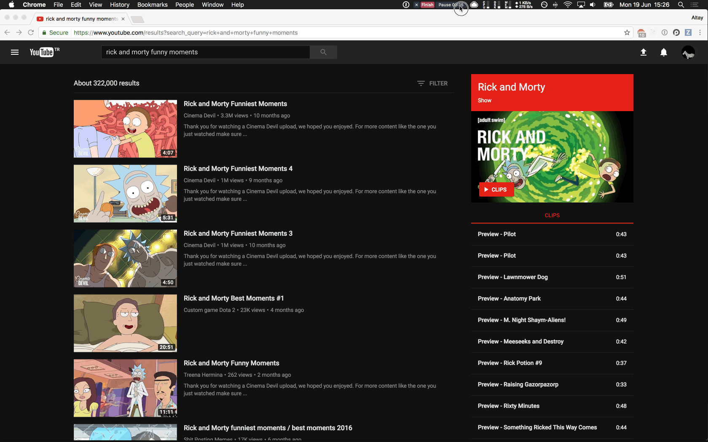

   

      
   

   <h1>putio-webextension</h1>
   

      Download links to put.io with right-click in browsers.
   

  
   
  
   

      
      
   

## Overview

`putio-webextension` adds a browser context-menu action for sending supported links to put.io.

## Install

Install from the browser store:

- Chrome: [Chrome Web Store](https://chrome.google.com/webstore/detail/putio/gmlaklldebhgnhfoppklejnjcmndcehf)
- Firefox: [Firefox Add-ons](https://addons.mozilla.org/en-US/firefox/addon/put-io)

## Use

Right-click a supported link and send it to put.io from the browser context menu.

## Docs

- [Contributing](./CONTRIBUTING.md) for setup, validation, and local testing
- [Security](./SECURITY.md) for private vulnerability reporting

## Repo Internals

- [Agent guide](./AGENTS.md) for repo-specific automation guidance

## Contributing

Use [Contributing](./CONTRIBUTING.md) for contributor workflow.
